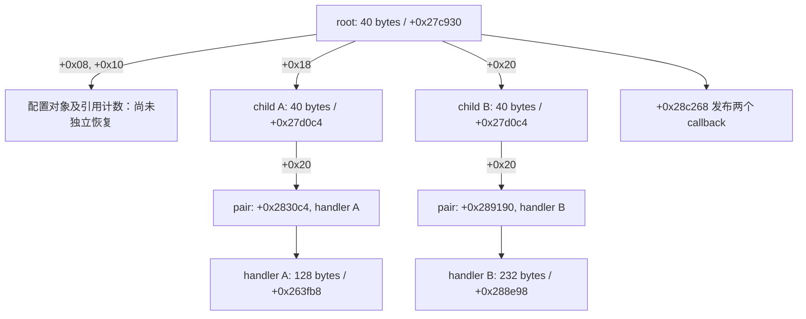

# 默认配置下的 signer 构造和 callback 发布

当前已恢复两个 child、两类 handler、引用计数 wrapper、root 已观测字段装配、空 callback 容器和最终 callback pair 绑定的 Python 模型。**完整 root constructor 与独立 fresh-input Medusa 仍未完成。** 本页只适用于已测番茄 `7.1.3.32` native artifact，不外推到抖音或其他平台。

两类证据分别是 [同次构造采样](evidence/vm9_signer_constructor_graph_20261003.json) 和 [新建内存对照](evidence/vm9_signer_objects_python_20261003.json)。前者说明实际桥接器走了哪条路径；后者说明哪些对象字段可以由输入生成。

## 实际默认路径与旧结论纠正

APK 默认 A/B 为 `2`。在这个配置下，singleton getter `+0x1658e4` 分配 16 字节 wrapper 和 40 字节 root，调用 `+0x27c930` 构造 root，再通过 `+0x165968` 为 wrapper 生成初值为 1 的四字节引用计数。singleton slot/guard 分别是 `+0x3d15d8/+0x3d15e0`。

root constructor 内的发布 helper 是 **`+0x28c268`**，调用点为 `+0x27cd9c`。以前报告中的 `+0x2a8760` 是旧误配 A/B 控制中的另一条真实路径，不是默认配置路径。证据和旧 exporter 已同步纠正。

新只读探针从 constructor 入口的真实 X0 获取对象地址，跟踪对象写入和 publication/return 时的快照。没有向 guest 注入对象、修改虚表或更换 handle。两轮探针均生成 802 字节 Medusa，与未加对象探针的同输入控制组摘要相同；初始化基本块为 97,657 条，丢弃 0 条。本轮采样未发送新的线上请求。

WriteHook 的 reported PC 可能指向执行块的邻近位置。字段写入归属必须结合静态指令和调用路径确认，不能把 reported PC 直接当作精确 store 地址。

## 对象关系



root 的 `+0x00` 在当前对象写入记录中没有被 constructor 写入。快照中恰好为零，不能据此把清零这个字段当成构造规则。`construct_signer_root` 现在只装配调用者显式提供的 `+0x08/+0x10/+0x18/+0x20` 四个依赖；配置对象本身、服务 singleton 和全局副作用仍需独立恢复。

| 组件 | 可生成的布局与边界 |
| --- | --- |
| 16 字节 reference wrapper | 对象指针、四字节 count 指针；count 初值 1。引用对象为 NULL 时也分配 count |
| reference copy | 复制两个指针；count 非空则做 32 位加一，保留 native 溢出及自别名行为 |
| 40 字节 child | 虚表、152 字节 state 指针、callback 容器引用/count、16 字节 pair 指针 |
| callback 容器 | 从三个 descriptor 输入字生成对象，另分配 40 字节 controller 和 40 字节 sentinel；sentinel 的未写 padding 保留 |
| 232 字节 handler | 生成两组 NULL reference/count 和 mutex holder；清 `+0x30..+0x4f`；在 `+0x50` 构造 state，末尾三字节 padding 保留 |
| 128 字节 handler | 同样生成基类字段；在 `+0x50/+0x60` 复制调用者提供的服务/flag references。两个 getter 的 guard/slot 和 flag 的 2 字节 payload 已独立建模；服务的 0x2d0 字节配置图仍要求显式 initializer |
| callback pair | child constructor 只分配，不写内容；root 随后写入入口地址与 handler 指针 |
| 40 字节 root | 保留 `+0x00`，写入两个 configuration/reference 指针和两个 child 指针；不创建 singleton 或 lazy string |

pair 的入口由真实虚表方法返回：128 字节 handler 的虚表 `+0x35dc50`、slot `+0x68` 经 `+0x28509c` 返回 `+0x2830c4`；232 字节 handler 的虚表 `+0x35f7e0`、slot `+0x60` 经 `+0x28aee0` 返回 `+0x289190`。同次快照确认这两种绑定，不需要假设两个 pair 可以互换。

## callback 语义

`+0x28c268` 按顺序调用 `0x2000001`、`0x2000002`。wrapper `+0x28c308` 传入同一个 root，int 参数为 0，string/object 为 NULL。两个调用都完成后才开始清理两个返回引用。

返回条件是 **首个 JNI 返回引用非 NULL**，没有 Boolean unboxing。清理 helper `+0x26f1d0` 在 env/ref 非空时调用 `GetObjectRefType`（虚表 `+0x740`），再按类型调用 DeleteLocalRef（`+0xb8`）、DeleteGlobalRef（`+0xb0`）或 DeleteWeakGlobalRef（`+0x718`）。未知类型不删除；env/ref 为空时不查询类型。

这恢复了 publisher 的调用规则。它没有生成 Java 对象存储、线程 attachment 或完整 callback 表；实际宿主需要提供这些依赖。

## Python 调用与复核

[python/vm9_objects.py](python/vm9_objects.py) 提供 `construct_reference_wrapper`、`copy_reference_wrapper`、`construct_mutex_state`、`construct_callback_container`、`construct_signer_child`、`construct_signer_handler` 和 `bind_signer_child_callback`。接口使用以 `address >> 12` 为索引的 4,096 字节可写 pages。

`allocate(staged_pages, size)` 必须只改传入 pages，并返回实际可读写的 guest 地址。引用计数和 callback 对象由输入与分配过程生成，不能传捕获对象充当独立状态。分配失败、未映射输出及错误 handler 类型会拒绝并回滚 pages；外部 allocator 的账本或其他宿主副作用不在回滚保证内。

先构造 child，再构造对应 handler，最后绑定 callback pair：

```python
child = construct_signer_child(
    pages, object_address=child_address, image_base=image_base, allocate=allocate)
construct_signer_handler(
    pages, object_address=handler_address, image_base=image_base,
    allocate=allocate, kind="embedded_state")
bind_signer_child_callback(
    pages, child_address=child.object_address, handler_address=handler_address,
    image_base=image_base, kind="embedded_state")
```

另一类 handler 的 `kind="service_refs"` 还需要 `service_reference_address` 与 `flag_reference_address`，这两个地址必须指向真实初始化的 16 字节 reference wrappers。`construct_service_reference(kind="flag")` 可直接生成 flag wrapper；`kind="service"` 要求调用者提供 0x2d0-byte payload initializer，不能用捕获状态或猜测常量替代。

`construct_lazy_reference` 实现了这些 getter 已证实的单线程语义：guard 已置位时返回 slot，不重复分配；首次调用按 wrapper、payload、四字节 count 的顺序分配，初始化 payload 后发布 slot 并置 guard；异常时 page map 回滚。对应的公开复核记录在 [vm9_service_singletons_python_20261003.json](evidence/vm9_service_singletons_python_20261003.json)，包含 5 个正例和 2 个回滚/拒绝例。configuration、service、flag 的 image-relative guard/slot 分别为 `0x3d15d0/0x3d15c8`、`0x3d1568/0x3d1560` 和 `0x3debc0/0x3debb8`。

[python/vm9_callbacks.py](python/vm9_callbacks.py) 的 `publish_signer_handle` 接收 root、env、invoke、get_reference_type 和 delete_reference。它实现已测发布和清理顺序，返回首个引用是否非空；宿主异常直接传播。

用本地匹配的私有 ELF 复核组件：

```text
python python/verify_vm9_signer_objects.py --library /private/libmetasec_ml_71332.so --libc /private/libc.so --output /private/signer-objects.json
```

验证器加载 ELF 代码和 relative relocations，在两种 image base 下新建有非零填充的 guest 内存。92 个对照验证对象布局、分配顺序、root 依赖装配、跨页、保留 padding、count 溢出/自别名、pair 绑定和 JNI 调用清理顺序。pthread mutex 初始化执行真实 libc 指令。另有 13 个拒绝/回滚案例。

分配、memset、diagnostic scope、线程 attachment 和 JNI 回调是显式 oracle 边界。flag getter 的 2 字节 payload 已由 fresh-input 模型覆盖；服务 getter 的嵌套字符串/configuration constructor 仍是显式 initializer 边界。验证运行需要 Unicorn/pyelftools（native 对照）或直接运行 `verify_vm9_service_singletons.py`（纯 Python）；模型本身不调用 JVM。

## 证据用途与剩余工作

同次采样把 root → child → handler → pair → 两次发布连接起来，可用于排除错误 handle/对象类型和错误 publisher 分支。新建内存对照证明这些局部对象可以参数化生成，不能据此声称完整初始化已经独立完成。

下一步仍需恢复 root 前段的配置/reference 构造、两个服务 singleton、diagnostic/global 启动副作用及剩余 native callbacks，再把这些组件接入 VM9 fresh-input 签名并贯穿同次采样验证。当前搜索仍无非空响应与分页证据；无 JVM Rust 下载器、抖音/起点闭环及最终 Pages 搜索下载网页也尚未完成。
