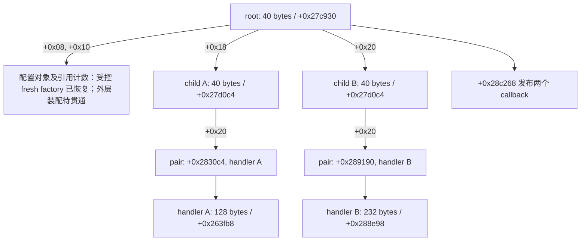

# 默认配置下的 signer 构造和 callback 发布


## 2026-10-06: fresh state-write boundary

One fresh native outer getter control (image base `0x122c0000`, absent
property) returned successfully after decoding lazy global lengths
`3, 5, 241, 3, 3`. It wrote zero to the hash/state global at
`+0x27ce44` (`image+0x3d1998`) and zero to the elapsed/timestamp state at
`+0x27ce6c` (`image+0x3e07c0`). The sanitized record is in
[state-write evidence](evidence/vm9_outer_constructor_state_write_boundary_20261006.json).

This is a direct fresh native observation of two stores, not a logger semantic
implementation. Formatter contents, locale and sink dispatch, `+0x26cf08`,
descriptor publication and fresh Medusa output remain unresolved.

## 2026-10-06: registry 双追加与 logger/state allocator 对照

外层 Python constructor 已继续恢复到 native allocation index 309。它从
fresh ELF 解码得到的两个全局字符串按真实调用点追加：`+0x27cd10` 使用
`+0x3e08d8`（`"51"`），随后释放临时字符串并执行第二个
`+0x27d188` child-B reference；`+0x27cdbc` 再使用 `+0x3e08e0`
（`"59"`）。第二次追加触发 `+0x246988` 的 16-byte string reserve，说明
增长分支由输入驱动并产生了 native 的 tcache 复用。

第二个临时 reference 释放后，`+0x28ded0` 的 logger/state 分支已恢复其
allocator 可观测边界：两轮 `64,128,256,8,8` 缓冲增长/释放，随后
`40,64,96` 状态对象和 `+0x165968` 的 4-byte singleton counter。四组
fresh 控制（两种 image base × absent/SDK 30）与 native 对照的 **310 次
allocation size/pointer、115 次 ordered free 全部一致**，见
[allocator match evidence](evidence/vm9_outer_constructor_allocator_match_20261006.json)。

这仍然不是完整 logger 语义：格式化内容、locale/sink dispatch、native
`+0x26cf08` handoff、descriptor writer 和 callback 参数发布尚未独立恢复。
因此 `complete_python_medusa`、fresh Medusa 输出、线上全头矩阵、无 JVM
Rust 下载链路、非空搜索/分页及其他平台闭环仍保持未完成。

## 2026-10-06: 外层 logger callback 与 active descriptor trampoline 边界

[边界 verifier](python/verify_vm9_outer_constructor_boundary.py) 在同次 fresh ELF/TLS/actual allocator 状态上跑过两种 image base 与 absent/SDK 30 共 4 组。每组先到达 `+0x26e9e0`，随后由 `+0x2584ac` 读取 descriptor：`argument+8` 是 descriptor，field0 是 relocated logger branch target，field8 是后续 x0 object；其余字段与 logger 的 first/second/width 参数块也保留在证据中。配套的 [native logger trace](python/verify_vm9_native_logger_trace.py) 在 4 组 native outer controls 中记录了 `+0x26e9e0 → +0x271ec8 → +0x271ddc` 的真实寄存器入口和 `+0x26cf0c` 返回点。控制在该 trampoline 明确拒绝，未执行猜测性的 no-op 或伪 callback。

这一步把 Python 当前的 trampoline 边界固定下来，但 native outer trace 证明外层 constructor 实际走的是 `+0x257084 → +0x257308 → +0x168324 → +0x26cf08 → +0x26e9e0 → +0x271ec8 → +0x271ddc`，没有执行 `+0x258488/+0x2584ac`。因此 Python 到达 trampoline 反映的是 VM prelude/分支差异，不能当成 native outer 已恢复。`+0x2887f0` 仍不是当前路径，native `+0x26cf08` handoff 和 descriptor writer 的 input-driven object graph 仍缺失。因而 `complete_python_medusa`、fresh Medusa 输出、online header matrix 和无 JVM Rust 链路继续保持 false。provider 的结果另见 [provider evidence](evidence/vm9_outer_constructor_logger_provider_20261006.json)。

## 同次 actual allocator/TLS 外层前段组合（2026-10-06）

新增 [外层前段 verifier](python/verify_vm9_outer_prefix_allocator.py) 与 [组合证据](evidence/vm9_outer_prefix_actual_allocator_20261006.json)。它从 fresh ELF 输入启动 `+0x28040c`，然后在同一实际 matching-libc allocator/TLS 状态中创建 registry、执行 `+0x256e50 → VM +0x98d50` 字符串 caller，最后接入 `+0x257578` root factory。两种 image base 和 absent/SDK 30 两种属性共 4 组通过；每组 3 个启动 descriptor、147 步 registry VM、716 步 root VM、217 次分配、94 次释放，输出 root reference count 为 1。缺页输入按事务回滚。

该 checkpoint 证明 Python 组件可以在同一次 guest 状态中传递 allocator、TLS、registry/reference 和 root，而不是把 native 前导快照拼接到 Python。它仍未完成 native whole-prefix 对照、matching-libc realloc、格式化 callback 或 fresh Medusa 输出；公开 JSON 也明确保留这些 false 边界。


当前已恢复两个 child、两类 handler、引用计数 wrapper、root 已观测字段装配、空 callback 容器、最终 callback pair 绑定，以及受控环境下的 264-byte 配置 root factory／caller／VM 默认初始化路径。后者的旧 nonreusing 对照为8组；2026-10-06 新增 actual allocator 的10组 native／8组 rollback 对照，均不依赖 native 入口快照，见 [ROOT_INITIALIZATION.md](ROOT_INITIALIZATION.md)。**完整外层 signer constructor、native whole-prefix 对照、全部 allocator 分支与独立 fresh-input Medusa 仍未完成；同次 Python actual-allocator 前段组合已通过。** 本页只适用于已测番茄 `7.1.3.32` native artifact，不外推到抖音或其他平台。

两类证据分别是 [同次构造采样](evidence/vm9_signer_constructor_graph_20261003.json) 和 [新建内存对照](evidence/vm9_signer_objects_python_20261003.json)。前者说明实际桥接器走了哪条路径；后者说明哪些对象字段可以由输入生成。

## 当前 registry 字符串 caller 与 C 字符串追加（2026-10-06）

已进一步补齐 [C 字符串追加](python/vm9_objects.py) `append_cstring_object`（`+0x2486b0 → +0x246e4c → +0x246f10`），并在 [registry owner](python/vm9_registry.py) 新增 `append_registry_string_caller`，独立生成 `+0x256e50` caller 和 `VM +0x98d50`。这两项是 Python 实现，不执行 native 指令，也不读取 native 入口快照。

C 字符串追加逐字节读写保留两个 prefix loop，再执行 reserve/memmove tail。容量恰好耗尽时仍可能为终止符扩容；与目标重叠的源不能提前整体读取。该 helper 的 tail 不创建 alias clone，因此移动 realloc 后必须读取旧地址的当时字节，验证器用 poison free/realloc 对照这一行为。realloc 的两次 NULL 返回按 native 规则保留先前的部分写入及已发布 length，外层 X0 仍返回对象；不支持的内存、bound 或 provider 异常按事务回滚。[专用 CLI](python/verify_vm9_cstring_append.py) **28 native／8 rollback**终态通过，覆盖 fits、empty、capacity exact-fill、长字符串、full/empty、跨页、self/suffix alias、unused-space alias、in-place/moving realloc、首次／全部 realloc NULL 及 late provider failure。见 [C-string 证据](evidence/vm9_cstring_append_native_20261006.json)。这不代表 matching-libc realloc 已恢复。

新 caller 从显式 SP、return、TLS canary、ELF 和 registry/source 对象生成参数与 32 槽输入；结束时保留实际 caller 的 32 槽工作区，供同一 SP 的后续调用使用。冷路径恢复两次 `+0x256fcc → +0x167e54` lazy decode；共同的 `+0x256fe0 → +0x268eb0` scoped writer、`+0x257024 → +0x248684` object append 和 `+0x257044 → +0x268fbc` release 均复用既有 owner。后续调用增加 `+0x257004 → +0x2486b0` C-string 追加。scoped scratch 是当前 VM native SP−`0x48`；这是 `+0x268eb0` 的实际 SP+8 pair，未多减一层 frame。释放前 TLS node 的七字节 padding 也严格比较，不能因释放后 poison 一致而省略。

[caller 差分 CLI](python/verify_vm9_registry_string_caller.py) **12 native／6 rollback**终态通过：两基址各覆盖冷调用、同次三次调用、扩容、空值/内嵌 NUL/二进制字节、改变 stack/canary，以及 allocator 时改变待复制的 stack padding。普通冷调用 147 VM steps，普通后续调用 119 steps，stop `+0x99018`。每次返回的全部32槽、guest／所有 main-image／TLS 字节、所有 pre-free bytes、allocator calls/live blocks 及 TLS/wake 顺序都匹配；并验证 caller 的 VM base 恢复。scoped TLS 是显式 warm component 服务，allocator 是合成 malloc/realloc/free effects；起点 registry 是既有布局 owner 生成的组件输入，而不是完整 process startup。见 [caller 证据](evidence/vm9_registry_string_caller_native_20261006.json)。

累计字符串变长时会进入额外的 **`+0x256ff0 → +0x248908` 格式化 callback**。该分支仍拒绝，并有先完成前两次大字符串 append、再在第三次拒绝的专用回滚检查；guest 页和 VM base 保持第三次调用前状态。没有删掉此边界来把整个 caller 宣称为任意输入已完成。unaligned SP、tagged return、缺失 source、VM step budget 和 late free provider failure 也明确拒绝。

受影响既有回归为 **204 native／22 rollback**：字符串 reserve/append/alias/cleanup 166/8，registry 初始化/getter 38/14，均终态通过。见 [回归摘要](evidence/vm9_registry_string_regression_20261006.json)。复现：

```powershell
python -B platforms/bytedance/tomato/python/verify_vm9_cstring_append.py --library "$env:TOMATO_LIBMETASEC" --output cstring-append-result.json
python -B platforms/bytedance/tomato/python/verify_vm9_registry_string_caller.py --library "$env:TOMATO_LIBMETASEC" --libc "$env:TOMATO_MATCHING_LIBC" --output registry-string-caller-result.json
```

**默认 registry 字符串 caller 的有界 Python 组件已通过；新的同次 actual allocator/TLS 前段组合也已通过。下一步做 native whole-prefix 对照，恢复格式化/realloc 边界，再继续 outer assembly 和 callback publication。格式化 callback、matching-libc realloc 和其他未测分支保留明确边界。fresh Medusa 输出、线上全头/f13 矩阵、Rust 下载链路、非空搜索与分页、抖音/起点和最终 Pages/Actions 产品仍未完成。

## 此前递归 mutex 与 native 外层冷启动（2026-10-06）

独立 actual root 的下一步 native 控制现已从 `+0x1658e4 → +0x27c930` 自然返回。此前的 **307 malloc／115 free** 停点是验证器拒绝递归 mutex 的能力边界，并非构造器错误；本轮已越过该点，旧停点不再代表当前进度。

[共享 native oracle](python/verify_vm9_signer_objects.py) 增加显式 `real_recursive_mutexes=True`，要求同时提供 matching libc 和 `real_mutexes=True`。非 NULL attrs 只接收实际 `attr_init → settype(1)` 得到的私有 recursive 值 1；普通 mutex 默认边界保留。oracle 在校验已恢复的串行状态后执行真实 libc export，不把 attrs 改成 NULL、不假设 lock 成功、不过滤该 PLT hook。其他 attrs、shared/error-checking/destroyed/wait 状态、缺失 owner、foreign-owner lock 和零 tid 均明确拒绝。

Python 复用 [既有 stdio mutex owner](python/vm9_libc_stdio.py)。本样本私有 recursive 状态为 `0x4000`，第一次 acquire 写 `0x4001` 和 owner；owner 从 `TPIDR_EL0+8 → pthread+0x10` 的 u32 读取。同线程递归增加状态中的 4，逐级 release 减 4，最后 release 清 owner 并恢复 `0x4000`。深度饱和返回 EAGAIN=11，错误 owner unlock 返回 EPERM=1；本轮没有恢复竞争等待、共享路径或真实 OS 原子并发。

[专用差分 CLI](python/verify_vm9_recursive_mutex.py) 的 **48 native／15 拒绝检查**终态通过：两基址、跨页对象、完整 `+0x329f88` attrs 构造、NULL attrs 普通初始化、首锁／重入／释放／溢出／错误 owner，以及同次构造→两次 acquire→两次 release→再次 acquire/release 的序列。序列在每次返回后比较整个可观察 guest 对象区；TLS tid=137/271，而 singleton gettid provider 保持 137，确认 recursive owner 来自 TLS。非 NULL attrs 与不支持状态在 native export 执行前拒绝。见 [递归锁证据](evidence/vm9_recursive_mutex_native_20261006.json)。

[外层 native-only CLI](python/verify_vm9_outer_signer_native.py) 的 **10 controls**终态通过：两基址×四 SDK profile，另两组改变 stack／mapping cursor／TLS canary。每组 cold getter 完成 **310 malloc PLT／115 free PLT／1 GC／3 small flush**，同次执行主启动 `+0x28040c`、root factory `+0x257578`、两 child、两 handler 和 `+0x28c268` 发布；之后再次调用实际 warm getter，复用同一 wrapper，没有新增 allocator／provider 副作用。wrapper 和配置的 count 都为 1，singleton slot／guard 发布、两类 handler vtable／callback pair、两次发布 tag 和 JNI reference 清理顺序都逐项断言。root 输入由 constructor 实际准备，flag=5；它的入口 SP 是 getter 入口 SP−`0x210`。未沿用旧私有探针的不准确 root backing 公式。见 [外层控制证据](evidence/vm9_outer_signer_native_20261006.json)。

该控制仍显式提供虚拟 OS、三条 thread descriptor、JNI attach/invoke/reference 类型及删除、clock、SDK 属性和诊断 scope。descriptor 的 entry 为 `+0x326a2c`、两次 `+0x3260a4`，本控制没有执行 worker，也没有真实 OS 线程或 JVM。**这证明有界服务契约下的 native 外层控制能返回，不证明完整 Python 外层构造器、同次 Python startup／root／worker 组合或 fresh Medusa 输出已通过。** 无新的线上请求，Perseus 全头矩阵与 f13 冻结实测仍未验收。

受影响回归为 **106 native／34 拒绝或 rollback 检查**：signer 组件 92/13、actual root 10/8、既有 stdio recursive 初始化 4/13，均终态通过。见 [回归摘要](evidence/vm9_recursive_mutex_regression_20261006.json)。

复现命令使用调用者持有的样本路径；报告只输出静态偏移、计数、合成 fixture 标识及布尔断言，不导出 native memory、请求或设备信息：

```powershell
python -B platforms/bytedance/tomato/python/verify_vm9_recursive_mutex.py --library "$env:TOMATO_LIBMETASEC" --libc "$env:TOMATO_MATCHING_LIBC" --output recursive-mutex-result.json
python -B platforms/bytedance/tomato/python/verify_vm9_outer_signer_native.py --library "$env:TOMATO_LIBMETASEC" --libc "$env:TOMATO_MATCHING_LIBC" --output outer-signer-result.json
```

此处记录 native-only 控制之后的接入方向；上方已进一步验收默认 registry 字符串 caller 的有界 Python 组件。完整 startup／prefix／actual root／outer publication 的同次 Python 组合与 fresh 签名输出仍未通过。

## 此前静态接入定位（2026-10-06）

`+0x257578` actual root factory 已独立通过后，静态 BL 复核定位到两个直接调用点：默认外层 constructor `+0x27c930` 内的 `+0x27cbe8`，以及另一路 `+0x2a67e0`。前者设置三个 reference、flag=5 和 X8 输出，返回后通过 `+0x27cbf4 → +0x27ceac` 装配外层 root。下一步优先恢复这个默认 constructor 的输入准备、装配和后续 child／callback publication，并在同次 startup 状态下验收。第二个调用点只说明另一路复用该 factory，不构成默认路径或签名输出已通过的证据。本节记录此前静态调用归属；当前 native-only 外层返回见上，完整 Python outer constructor 组合仍未 PASS。

## 实际默认路径与旧结论纠正

APK 默认 A/B 为 `2`。在这个配置下，singleton getter `+0x1658e4` 分配 16 字节 wrapper 和 40 字节 root，调用 `+0x27c930` 构造 root，再通过 `+0x165968` 为 wrapper 生成初值为 1 的四字节引用计数。singleton slot/guard 分别是 `+0x3d15d8/+0x3d15e0`。

root constructor 内的发布 helper 是 **`+0x28c268`**，调用点为 `+0x27cd9c`。以前报告中的 `+0x2a8760` 是旧误配 A/B 控制中的另一条真实路径，不是默认配置路径。证据和旧 exporter 已同步纠正。

新只读探针从 constructor 入口的真实 X0 获取对象地址，跟踪对象写入和 publication/return 时的快照。没有向 guest 注入对象、修改虚表或更换 handle。两轮探针均生成 802 字节 Medusa，与未加对象探针的同输入控制组摘要相同；初始化基本块为 97,657 条，丢弃 0 条。本轮采样未发送新的线上请求。

WriteHook 的 reported PC 可能指向执行块的邻近位置。字段写入归属必须结合静态指令和调用路径确认，不能把 reported PC 直接当作精确 store 地址。

## 对象关系



root 的 `+0x00` 在当前对象写入记录中没有被 constructor 写入。快照中恰好为零，不能据此把清零这个字段当成构造规则。`construct_signer_root` 现在只装配调用者显式提供的 `+0x08/+0x10/+0x18/+0x20` 四个依赖；服务 singleton 和默认配置 root factory 的已测构造分支已恢复，但外层 root constructor 的装配、配置 getter 和后续全局副作用仍需贯通。

| 组件 | 可生成的布局与边界 |
| --- | --- |
| 16 字节 reference wrapper | 对象指针、四字节 count 指针；count 初值 1。引用对象为 NULL 时也分配 count |
| reference copy | 复制两个指针；count 非空则做 32 位加一，保留 native 溢出及自别名行为 |
| 40 字节 child | 虚表、152 字节 state 指针、callback 容器引用/count、16 字节 pair 指针 |
| callback 容器 | 从三个 descriptor 输入字生成对象，另分配 40 字节 controller 和 40 字节 sentinel；sentinel 的未写 padding 保留 |
| 232 字节 handler | 生成两组 NULL reference/count 和 mutex holder；清 `+0x30..+0x4f`；在 `+0x50` 构造 state，末尾三字节 padding 保留 |
| 128 字节 handler | 同样生成基类字段；在 `+0x50/+0x60` 复制服务/flag references。可由显式依赖装配，也可按 native 顺序调用两个已恢复的 getter，生成服务的 0x2d0 字节配置图和 flag 的 2 字节 payload |
| callback pair | child constructor 只分配，不写内容；root 随后写入入口地址与 handler 指针 |
| 40 字节 root | 保留 `+0x00`，写入两个 configuration/reference 指针和两个 child 指针；不创建 singleton 或 lazy string |

pair 的入口由真实虚表方法返回：128 字节 handler 的虚表 `+0x35dc50`、slot `+0x68` 经 `+0x28509c` 返回 `+0x2830c4`；232 字节 handler 的虚表 `+0x35f7e0`、slot `+0x60` 经 `+0x28aee0` 返回 `+0x289190`。同次快照确认这两种绑定，不需要假设两个 pair 可以互换。

## callback 语义

`+0x28c268` 按顺序调用 `0x2000001`、`0x2000002`。wrapper `+0x28c308` 传入同一个 root，int 参数为 0，string/object 为 NULL。两个调用都完成后才开始清理两个返回引用。

返回条件是 **首个 JNI 返回引用非 NULL**，没有 Boolean unboxing。清理 helper `+0x26f1d0` 在 env/ref 非空时调用 `GetObjectRefType`（虚表 `+0x740`），再按类型调用 DeleteLocalRef（`+0xb8`）、DeleteGlobalRef（`+0xb0`）或 DeleteWeakGlobalRef（`+0x718`）。未知类型不删除；env/ref 为空时不查询类型。

这恢复了 publisher 的调用规则。它没有生成 Java 对象存储、线程 attachment 或完整 callback 表；实际宿主需要提供这些依赖。

## Python 调用与复核

[python/vm9_objects.py](python/vm9_objects.py) 提供 `construct_reference_wrapper`、`copy_reference_wrapper`、`construct_mutex_state`、`construct_callback_container`、`construct_signer_child`、`construct_signer_handler` 和 `bind_signer_child_callback`。接口使用以 `address >> 12` 为索引的 4,096 字节可写 pages。

`allocate(staged_pages, size)` 必须只改传入 pages，并返回实际可读写的 guest 地址。引用计数和 callback 对象由输入与分配过程生成，不能传捕获对象充当独立状态。分配失败、未映射输出及错误 handler 类型会拒绝并回滚 pages；外部 allocator 的账本或其他宿主副作用不在回滚保证内。

先构造 child，再构造对应 handler，最后绑定 callback pair：

```python
child = construct_signer_child(
    pages, object_address=child_address, image_base=image_base, allocate=allocate)
construct_signer_handler(
    pages, object_address=handler_address, image_base=image_base,
    allocate=allocate, kind="embedded_state")
bind_signer_child_callback(
    pages, child_address=child.object_address, handler_address=handler_address,
    image_base=image_base, kind="embedded_state")
```

另一类 handler 的 `kind="service_refs"` 可以传入真实初始化的 `service_reference_address` 与 `flag_reference_address`，或设置 `initialize_services=True`，由 Python 在对应 reference copy 前依次调用真实布局的服务/flag getter。首次调用需显式提供 `thread_id`，已发布的 getter 不需要它。`construct_service_reference(kind="service")` 默认调用已恢复的 `construct_service_payload`，不再要求外部 initializer。

`construct_lazy_reference` 支持无竞争的单线程 guard：byte0 非零时返回 slot；byte0 为零时，byte1 的 bit1 表示正在初始化，模型拒绝递归/等待；byte1 等于 1 时 acquire 返回 0，仍返回 slot。冷启动把显式线程 ID 写入 guard+4，把 byte1 写为 2；发布 wrapper 后 release 将 byte0/byte1 都写为 1，保留 +2/+3 padding。异常时 page map 回滚，外部 allocator 账本不在回滚保证内。configuration、service、flag 的 image-relative guard/slot 分别为 `0x3d15d0/0x3d15c8`、`0x3d1568/0x3d1560` 和 `0x3debc0/0x3debb8`。

旧 [vm9_service_singletons_python_20261003.json](evidence/vm9_service_singletons_python_20261003.json) 的 5/2 是 Python 自检，不能当作完整 native 等价证明。2026-10-04 的真实 guard 指令对照纠正了旧模型只写 byte0、遗漏 byte1/线程 ID 的差异。新增 [vm9_service_singletons_native_20261004.json](evidence/vm9_service_singletons_native_20261004.json) 有 72 个 native 差分案例和 15 个拒绝/回滚案例。

## 已恢复的服务 payload

`+0x281700` 的 0x2d0-byte 对象由输入生成，不复制捕获对象。模型分别读取 readonly ELF 常量、relocated GOT 和调用者提供的 guest 字符串/数值。服务 getter 冷启动共进行 27 次分配；其中 payload constructor 本身为 24 次，另有外层 wrapper、payload 和 count 三次。

| payload 字段 | 构造规则 |
| --- | --- |
| `+0x00` | 新分配 152-byte state 指针；先整体清零，再构造虚表和 mutex state |
| `+0x08/+0x10` | 清 u64 和一个字节；其余 padding 保留 |
| `+0x18..+0x3f` | callback 容器，虚表 `+0x35b7c0`；descriptor 为 `+0x25686c/+0x165334/+0x281958`；40-byte controller 的 hook 为 `+0x24b560`，另有 40-byte sentinel |
| `+0x40/+0xa0/+0x68` | 分别清 16/16/48 字节 |
| `+0x50/+0xb0/+0x58` | u32 `0x10000`、u32 零、image+`0x6e500` 的 16-byte 常量 |
| `+0x98` | 新分配 48-byte mutex holder，NULL attributes 的 bionic mutex 布局 |
| `+0xb8` | 新分配的 24-byte empty string 对象及四字节引用计数 |
| `+0xc8/+0xd0` | 清 u64/u32 |
| 17 个 inline string 对象 | 逐次构造，虚表 `+0x34f5f8`。`+0x298` 使用 ELF 空字符串；其余从 GOT `+0x374fc0` 指向的 pointer slot 每次重新解引用 |
| `+0x108/+0x160/+0x180/+0x190/+0x1b0/+0x1c8` | 在 native 读点保存 GOT `+0x375020` 的有符号 u32，生成重复整数和 float32；后续分配改变输入不会改写已保存值 |
| `+0x1b8/+0x1c0/+0x290` | 在 native 读点保存 GOT `+0x375030` 指向的 u64 |
| `+0x2b0` | 在最后一个字符串构造前读取 image+`0x3e0b58` |

新 verifier 比较整个 guest 对象/分配区和所有加载的 image pages，包括 guard/slot 全局状态。覆盖两个 image base、跨页、ELF 默认值、NULL/空/UTF-8/长字符串、正负整数和 int32 边界、冷热 guard、服务到 handler 的连续构造，以及 allocator 在分配中修改字符串源和数值的输入时序。真实 ELF guard helpers 和匹配 libc 的 `pthread_mutex_init` 指令均参与执行。

```python
construct_signer_handler(
    pages, object_address=handler_address, image_base=image_base,
    allocate=allocate, kind="service_refs", initialize_services=True,
    thread_id=guest_thread_id,
)
```

模型只保证测得的成功、无竞争构造分支；operator-new 重试/抛异常和诊断全局副作用仍不在模型内。caller 必须提供合法 image/GOT 输入和可写分配区。

[python/vm9_callbacks.py](python/vm9_callbacks.py) 的 `publish_signer_handle` 接收 root、env、invoke、get_reference_type 和 delete_reference。它实现已测发布和清理顺序，返回首个引用是否非空；宿主异常直接传播。

用本地匹配的私有 ELF 复核组件：

```text
python python/verify_vm9_signer_objects.py --library /private/libmetasec_ml_71332.so --libc /private/libc.so --output /private/signer-objects.json
```

验证器加载 ELF 代码和 relative relocations，在两种 image base 下新建有非零填充的 guest 内存。92 个对照验证对象布局、分配顺序、root 依赖装配、跨页、保留 padding、count 溢出/自别名、pair 绑定和 JNI 调用清理顺序。pthread mutex 初始化执行真实 libc 指令。另有 13 个拒绝/回滚案例。

上述 92 个组件对照仍把服务 getter 作为显式 reference 输入边界。新的 72 个服务对照则真实执行三个 singleton getter 和 `+0x281700`；malloc、strlen、memcpy、memset、gettid 和成功的 guard mutex 是显式宿主边界，diagnostic scope effects 仍被排除。验证运行需要 Unicorn/pyelftools；模型本身不调用 JVM。

```text
python python/verify_vm9_service_singletons.py --library /private/libmetasec_ml_71332.so --libc /private/libc.so --output /private/service-singletons.json
```

## 264-byte root 配置：布局与后续默认初始化

`construct_root_configuration_layout` 对照 `+0x257084` 到 `+0x257240` 的真实指令，生成 264-byte 对象及 30 次嵌套分配。它在复制第三个配置字符串到临时引用、调用 `+0x257308` 之前结束，不能直接当作完成初始化的 root 使用。它与 8-byte configuration singleton 是不同对象。后续默认 initializer、caller 和更早 factory 已在受控 fresh 输入下恢复，见 [ROOT_INITIALIZATION.md](ROOT_INITIALIZATION.md)；该 layout API 本身仍只返回前缀。

| 字段 | Python 已恢复的规则 |
| --- | --- |
| `+0x00/+0x08` | 虚表 `+0x35b688`；复制初始 reference/count，非空 count 加一 |
| `+0x18/+0xc0` | 两个新建 40-byte callback 容器，各有 controller、sentinel 和 reference count；descriptor 为 `+0x182d6c/+0x182d6c/+0x188a94` |
| `+0x28/+0x38/+0x48/+0x58/+0x70/+0xb0` | 六个新建空 string 对象与 count；从 ELF `+0x6fe64` 读取字符串输入 |
| `+0x68` | u64 全一 |
| `+0x80/+0x90` | 按调用次序复制两个输入 reference/count，保留共享计数与 u32 溢出行为 |
| `+0xa0/+0xd8/+0xf0` | NULL reference，分别新建初值为 1 的四字节 count |
| `+0xd0/+0xe8` | 调用者的 u32 flag；u32 零；邻近 padding 保留 |
| `+0x100` | 新建 152-byte state，先清零再执行已恢复的 state/mutex 构造规则 |

同一 owner 还新增 `decode_masked_bytes`、`lock_uncontended_mutex` 和 `unlock_uncontended_mutex`。`+0x167e54` 逐字节读 mask、读 source、写 XOR 结果；遇到零 mask 停止，不补字符串终止符。模型保留输出与 source/mask 重叠时的读取次序。mutex 只实现已测 bionic normal 分支：`0/0x2000 → 1/0x2001 → 0/0x2000`，只改低半字，保留其余字节；竞争、递归、错误检查和销毁状态拒绝。该模型不提供真实线程原子性。

[配置组件证据](evidence/vm9_configuration_primitives_native_20261004.json) 共 72 个 native 差分、25 个拒绝/回滚案例。其中 16 个验证配置布局、完整分配顺序、共享引用、NULL count、溢出、flag 和跨页；其余 56 个验证 decoder 和 mutex。所有模型输入均由 fresh ELF 或显式 guest 输入生成。

```text
python python/verify_vm9_configuration_primitives.py --library /private/libmetasec_ml_71332.so --libc /private/libc.so --output /private/configuration-primitives.json
```

## fresh ELF 的 native 初始化基线

新的 [root 初始化证据](evidence/vm9_root_configuration_native_20261004.json) 在两个 image base、八种 SDK 属性输入下，真实执行 `+0x257578 → +0x257084 → +0x257308`，16 个案例均正常返回，各进行 206 次分配与 31 对 mutex lock/unlock。**这份历史证据只证明 native 基线；新的纯 Python 默认 factory 证据单独记录于 [ROOT_INITIALIZATION.md](ROOT_INITIALIZATION.md)，不能把两种验证混为一谈。**

前两个 root 输入共享同一 reference；两个不同的字符串从 ELF 常量解码，长度分别为 4 和 240。输入 count 使用显式测试值 7。字符串内容只留在本地内存中。malloc/free 的 ABS64 链接按 relocation 表绑定到明确分配边界，不能把 NULL allocator descriptor 随意替换成业务 callback。

系统属性 getter `+0x271ba8` 解码名称到 `+0x3df150`、在 `+0x3df168` 发布名称 flag，并读取 `+0x3df148` 的 u32 cache。cache 为零才 find/read；解析结果按有符号 w0 比较，至少为 1 才写 cache。实测 cache：属性不存在、`0`、`-1` 为 0；`30` 为 30；带空白、正号与后缀的输入为 31；`4294967326` 截成 w0 后为 30；`2147483648` 及正 int64 溢出输入返回 0。该解析器经过 136-byte singleton 与 native 包装；目前没有用简化 atoi 替代它。

这次还修复了验证环境本身的干扰：旧 pthread 区间与深调用栈重叠，真实 `pthread_getspecific` 曾把保存的返回地址覆盖为 1。只移动 TLS/pthread 区域的对照恢复了正确返回。新验证器检查栈不进入 TLS 区域；当前最深 SP 为 guest+`0xd180`，TLS/pthread 区域结束于 guest+`0xab00`。

真实 libc 执行 mutex、strtol、pthread once/key 和 condition broadcast 等指令。显式虚拟宿主只提供属性值、clock/errno、文件不存在、目录 EEXIST、socket family 不支持、无等待者 futex WAKE，以及两个析构登记；不执行未知析构、不进行宿主文件或网络操作。输入与输出状态不能外推为实际手机环境已验证。

```text
python python/verify_vm9_root_configuration.py --library /private/libmetasec_ml_71332.so --libc /private/libc.so --output /private/root-configuration.json
```

## 88-byte 对象构造及内部解析器（2026-10-04）

`construct_configuration_object_layout` 已恢复 `+0x26194c → +0x261a1c` 的构造前缀。在两个输入长度均为非负、分配成功时，共进行九次嵌套分配。它在后续初始化前停止；其返回的 `ConfigurationObjectLayout88` 不能当作已初始化对象使用。

| 字段/全局 | 恢复规则 |
| --- | --- |
| image `+0x3deb60/+0x3deb68` | u32 flag 为零时，从 source/mask `+0x9a68c/+0x9a6dc` 解码，再发布 flag=1；任意非零 flag 均保留原内容 |
| object `+0x00` | 虚表 `+0x35ba78` |
| `+0x08` | 新建 24-byte string，从第一个输入 string 克隆，另建初值为 1 的四字节 count |
| `+0x18` | NULL reference，另建初值为 1 的四字节 count |
| `+0x28` | 从第二个输入 string 克隆的 inline 24-byte string |
| `+0x40..+0x47` | 未写 padding 保留 |
| `+0x48` | 新建 48-byte container/reference/count，容器虚表 `+0x35b808`，callback/context/comparator 为 `+0x182d6c/0/+0x188a94` |
| container `+0x20/+0x28` | inline comparator 和新建 8-byte holder；holder 指向新建 24-byte sentinel，sentinel 前两个指针自引用、第三个指针为 NULL |

这里的 48-byte container 与之前的 40-byte callback 容器具有不同的内部布局，分别建模。`clone_string_object` 对照 `+0x2483e0`：先保存 source object 的 u32 length，再写目标，分配后才读 source payload pointer；按声明长度复制，保留内部 NUL，并补一个终止字节。负 int32 length 不分配，但保存原 length 与回绕后的 capacity；malloc NULL 保留长度和 NULL payload。`construct_sized_string_object` 对照 `+0x2481fc`，其负长度或 malloc NULL 会清空两个长度字段，与 clone 的失败语义不同。

`acquire_uncontended_shared_reader` / `release_uncontended_shared_reader` 对照 `+0x32a444/+0x32a4fc`：锁 normal mutex，改变 `mutex+0x88` reader count，再解锁。已验证共享 bit、跨页和 `0x7ffffffe` 边界。writer bit、饱和 count、release 零 count、等待和 signal 分支拒绝并回滚。它们只提供串行 guest 内存转换，不提供宿主线程原子性。

[对象组件证据](evidence/vm9_configuration_objects_native_20261004.json) 有 **140 个 native 差分和 23 个拒绝/回滚案例**，覆盖上述对象前缀、全局 flag、声明长度克隆、allocator 改变源输入的读点、self alias、reader count 与未映射页。clone 的 malloc NULL 另有 Python 自检，未将它计入 native 差分数。

后续 native 路线已实测为 `+0x261c54 → +0x261cb0 → VM +0x9a6f0`。其中 `+0x258e7c` 的 Base64 解码/reference 依赖已恢复为 `construct_decoded_configuration_reference`：先按输入长度分配临时缓冲区，执行 `decode_configuration_base64`，有效非空结果生成 sized string，随后调用显式 free，最后构造 reference/count。无效或空结果生成 NULL reference，而非伪造成功字符串。

`decode_configuration_base64` 对照 `+0x245814`，从私有 ELF `+0x95cc0` 读取 lookup table，保留 native 的换行、行尾空格、padding、缓冲区查询和未满组丢弃规则。返回 0、-42 或 -44；无效输入不写输出长度。查询/容量不足使用 native 的向上取整长度，实际成功长度按完整解码组计算。不要以标准 Base64 库的行为替代这些规则。[解码组件证据](evidence/vm9_configuration_decode_native_20261004.json) 有 **200 个 native 差分和 11 个拒绝/回滚案例**，包含空输入、二进制、内部 NUL、非标准残组、重叠输出、跨页和分配/free 拒绝。free 在此 verifier 中为明确的不复用分配边界；真实 allocator 的 free 状态仍需接入实际宿主。

```text
python python/verify_vm9_configuration_objects.py --library /private/libmetasec_ml_71332.so --libc /private/libc.so --output /private/configuration-objects.json
python python/verify_vm9_configuration_decode.py --library /private/libmetasec_ml_71332.so --output /private/configuration-decode.json
python python/verify_vm9_root_vm_prefix.py --library /private/libmetasec_ml_71332.so --libc /private/libc.so --output /private/root-vm-prefix.json
```

新的 [同次 fresh native VM 对照](evidence/vm9_root_vm_prefix_native_20261004.json) 使用两个 image base、SDK 缺失/30 两种输入，共四次 native 控制运行和八段 Python VM 对照：

| VM 子阶段 | 已验证边界 | 结果 |
| --- | --- | --- |
| root `+0x991c0` | 第 513 步 `+0x99b40` 的 `+0x26194c` callback 内，Python 生成至 `+0x261a1c` 的前缀；包括此前两次和本构造九次分配 | 整个 guest 对象/分配区、11 次分配顺序、全部主 image pages 与同次 native 一致 |
| parser `+0x9a6f0` | 第 725 步 `+0x9b200`，wrapper `+0x2635ac` 调用 `+0x248dd8` 前 | guest、主 image、TLS/generation、100 次分配及 26 次 free 顺序、24-byte descriptor 一致；已贯通 mode-0 解密、流运算/reference、冷初始化和部分删除 |

两段 VM 的初始状态均来自**这次 native 运行的构造前导快照**，用于差分验证；没有外部签名捕获页，也没有 trace/branch/opaque 注入。但构造前导尚未全部由 Python 生成，所以这不是从完整 Python 启动到解析结束的证明。当前组合对照同时覆盖隔离 TLS 和完整 2256-byte generation 表，但不包含 libc 和 native 调用栈的全部副作用。当前首个未恢复 parser callback 为 `+0x248dd8`，详见 [CIPHER_CALLBACK.md](CIPHER_CALLBACK.md) 和 [STREAM_REFERENCE.md](STREAM_REFERENCE.md)。

## 字符串追加、扩容、清理与摘要回调

`append_string_object` 对照 `+0x248684 → +0x246ba0`，在原内容后追加 source 的声明长度数据；wrapper 即使内部返回 -1 也返回 destination object。`append_string_fields` 返回内部的有符号状态。fields 为 16 字节的 capacity/u32 length/payload pointer。

`reserve_string_fields` 对照 `+0x2468e8`。容量比较为严格大于：capacity 等于请求仍可能增长。`round_string_capacity` 保留 native 的 signed w32 取整规则，例如 8→16、16→32；溢出候选值小于原请求时保留原请求。增长按容量/长度比例选择 malloc/copy/free 或 realloc；malloc NULL 转入 realloc，rounded realloc NULL 再按原请求重试。分配和 free 后按 native 顺序重读字段，再发布 pointer/capacity 和终止符。

增长前，若 source payload 位于 destination buffer 内，先生成独立的 fields/payload clone；成功或失败后均按实际分支清理临时 clone。正常追加使用 memmove 语义。`destroy_string_fields` 对照 `+0x246d7c` 清理 clone；`destroy_string_object` 对照 `+0x2484b8/+0x2484fc`，先保存 payload、写回虚表、free 非空 payload，再清 pointer 并从 ELF `+0x6e208` 恢复空 fields。delete 分支最后 free 外层对象。

[字符串证据](evidence/vm9_strings_native_20261004.json) 有 **166 个 native 差分和 8 个拒绝/回滚案例**，验证两种 image base、跨页、self/partial alias、分配失败重试、realloc 移动/原地和宿主在 native 读点修改 length 的情况。两侧使用相同的显式 malloc/realloc/free 规则；释放与移动后的旧缓冲区填充非零字节，以检测过期指针读取。这不证明 Android allocator 已完整实现。

`construct_digest_reference` 对照 `+0x25874c` 的 MD5 和 `+0x258780` 的 SHA-1：按输入 string 的声明长度求摘要，flag bit0 为零时构造 raw digest string，为一时构造 hex string。hex 每个半字节都重读 guest GOT `+0x37a068` 指向的字母表；完成转换后才发布 caller reference。SHA-1 还按 native 规则从 ELF source/mask `+0x95b78/+0x95b7c` 延迟生成 `+0x3de27c` 的 padding 并发布 `+0x3de280` flag。非标准 padding 拒绝。MD5 的 NULL payload 分支按空输入处理。

[摘要证据](evidence/vm9_parser_digests_native_20261004.json) 有 **142 个 native 差分和 5 个拒绝/回滚案例**，包含单字节追加、raw/hex、flag 0/1/2/3、空输入、二进制、跨 block/跨页、NULL payload、分配失败，以及分配期间修改字母表、GOT 和源数据。比较整个 guest 对象/分配区、全部主 image pages、allocator 状态和调用顺序。数据均为 synthetic 输入；native 摘要指令真实执行，Python 使用 `hashlib`。hash 初始化常量限定为匹配 build 的 guest 状态；不支持任意变更 hash 初始状态。模型返回新 string pointer，不将其宣称为 native X0。

```text
python python/verify_vm9_strings.py --library /private/libmetasec_ml_71332.so --output /private/strings.json
python python/verify_vm9_parser_digests.py --library /private/libmetasec_ml_71332.so --output /private/parser-digests.json
```

两类模型遇到未知页或未恢复 effect 会回滚 guest pages；明确建模的分配失败保留 native 已发生的内存变化。外部 allocator 账本不属于 page 回滚保证，caller 应自行管理它。operator-new 重试/异常、诊断和 native 临时栈副作用仍是明确的边界。

后续 `+0x259dbc` 的一次 fresh native 控制实测调用了 `+0x276b9c → +0x161068 → +0x166370`，进入 136-byte singleton 的首次构造，随后调用 `+0x25ab1c` 分块处理。这个依赖必须恢复并验证，不能仅替换末端运算就宣称 callback 或 88-byte 初始化完成。

## 136-byte singleton、配置 registry 与 TLS 依赖

以下是此前的前缀和 TLS 组件证据；后续的配置树与完整构造主体证据见下一节。**完整 Python 冷启动仍未完成。**

| 组件 | Python 已恢复行为 | native 差分 / 拒绝回滚 |
| --- | --- | --- |
| 136/320-byte 构造前缀及依赖 | 五个条件 decoder、GOT table 读取、48-byte normal mutex、完整 56-byte helper、320-byte 容器布局和 realtime clock wrapper | [78 / 13](evidence/vm9_singleton136_native_20261004.json) |
| emulated TLS `+0x34377c` | 冷 once/key、descriptor index、线程 pointer array 的初始化/扩容、对齐变量及 template 初始化 | [60 / 12](evidence/vm9_emulated_tls_native_20261004.json) |
| matching bionic key 创建 | 141 项 generation 表扫描、destructor 写入、u32 key 发布及 EAGAIN | [36 / 4](evidence/vm9_pthread_keys_native_20261004.json) |
| 线程析构注册与 TLS 树初始化 | `+0x34265c` 本地 fallback 的冷 key、TLS 注册标记和 24-byte 链表节点；`+0x269880` 的树头与析构注册 | [32 / 5](evidence/vm9_thread_destructors_native_20261004.json) |
| 单个活跃 mutex 的作用域 writer 锁 | `+0x268eb0/+0x268fbc` 的节点创建、同 mutex 重入、writer count、广播、擦除和 free | [42 / 7](evidence/vm9_scoped_lock_native_20261004.json) |

`construct_singleton_layout136` 从 `+0x166370` 恢复到 `+0x166544`。五个 decoder 分别发布 `+0x3d16b4/+0x3d16e4/+0x3d1714/+0x3d1744/+0x3d1774` flag。`+0x173470` 必须先读 GOT `+0x379968`，再读其 table pointer 减 `0xe6fde0` 的内容，不能把默认有效位置 `+0x3d1900` 固定为输出。前缀按顺序分配 `[48,48,56,48]`，生成两个 mutex 和带第三个 mutex 的 helper；保留没有写入的 padding。getter `+0x161068` 的 slot/guard 为 `+0x3d1678/+0x3d1680`，完整 payload 构造已由下节的 `get_singleton136_reference` 接入该 getter。

`construct_registry_layout320` 恢复 `+0x2566ec → +0x256808`，包括三个独立 40-byte 容器/控制器/sentinel、152-byte mutex state 和空 string，共七次分配。getter `+0x15e694` 的 slot/guard 为 `+0x3d1550/+0x3d1558`。后续 `+0x256898` 的 16-byte clock wrapper 已单独恢复，并由下一节的完整构造器组合验证初始配置插入。**`+0x26cc60` 是 realtime clock getter，不是线程启动。** `+0x329404` 先生成按 u64 wrap 的有符号微秒，`+0x291958` 再除以 1000 并向零截断；clock 失败路径拒绝，不返回伪造时间。

`get_emulated_tls_address` 读取四个 u64 的 size/alignment/index/template control，使用显式 staged-page key/get/set/wake 边界。index 初次分配有 normal mutex 保护；pointer array 按 native 容量规则扩容，对齐块保存 back-pointer，malloc 后重读 template。native 忽略 `pthread_setspecific` 返回值的行为也予以保留。冷 once 从 0→1→2 后必须执行一次 `FUTEX_WAKE_PRIVATE`，即使没有等待者；这条副作用由扩大同次验证发现并补齐。缺失 wake 边界、errno 路线、malloc/realloc NULL、未知 alignment/once/mutex 等未恢复分支拒绝并回滚 pages。

本轮 matching libc 的 generation table 是 **libc-relative `+0xe0200`**，而不是旧 checkpoint 使用的 `+0x1d0200`。表有 141 项，每项 16 bytes；线程 slot 在 pthread 对象 `+0xe8 + index*16`。`pthread_key_create` 串行找 even/free generation、加一、写 destructor，最后发布 `index|0x80000000`；全占用返回 11。新调用者明确传入当前 table 地址；旧 checkpoint 的地址默认值不代表当前 libc ABI。这里没有创建宿主 key，也不提供并发原子性或实际析构执行。

`initialize_scoped_tls_registry` 使用 controls `+0x382470/+0x382450`。第一次调用设置线程标记并生成 leftmost/sentinel、root、count 三字段树头，然后登记 destructor。本地 `register_emulated_thread_destructor` 独立创建 `+0x3e2fb0` 的 key，并使用 controls `+0x3d13a0/+0x3d13c0` 管理线程标记与析构链表。malloc/setspecific 的已建模失败按 native 返回 u32 -1；导入版 thread-atexit、key-create abort 和竞争分支拒绝。注册不等于析构已执行。

作用域锁目前支持空 TLS 树或同一个 mutex 的单节点。新节点为 48 bytes；native 把临时 pair 的 16 bytes 整体复制到节点，其中含七个 stack padding bytes。模型明确接收原始工作区，按 native 顺序写 pointer/bool，并在 malloc 后读取；不能把 padding 清零或复制 native 的分配后输出。首次 writer 把 mutex `+0x90` 设置为 `0x80000000`；同 mutex 已拥有锁时新 guard 保留非零 status，清理时不释放外层锁。拥有锁的清理先清 writer count，在 mutex `+0x30` 广播，再擦除节点并 free。matching bionic broadcast 把 condition u32 加四后调用显式无等待者 wake。多个活跃 key、共享 reader 和等待分支仍拒绝，尚未恢复通用 TLS 红黑树。

```text
python python/verify_vm9_singleton136.py --library /private/libmetasec_ml_71332.so --libc /private/libc.so --output /private/singleton136.json
python python/verify_vm9_emulated_tls.py --library /private/libmetasec_ml_71332.so --libc /private/libc.so --output /private/emulated-tls.json
python python/verify_vm9_pthread_keys.py --library /private/libmetasec_ml_71332.so --libc /private/libc.so --output /private/pthread-keys.json
python python/verify_vm9_thread_destructors.py --library /private/libmetasec_ml_71332.so --libc /private/libc.so --output /private/thread-destructors.json
python python/verify_vm9_scoped_lock.py --library /private/libmetasec_ml_71332.so --libc /private/libc.so --output /private/scoped-lock.json
```

扩大后的 [同次 fresh native 对照](evidence/vm9_root_vm_prefix_native_20261004.json) 仍为两个 image base、SDK 缺失/30，共四次 native 控制运行。除八段原 VM 对照外，增加八段构造前缀、八次 TLS 调用、四次完整冷 TLS 树初始化和八次作用域锁对照。每个 cold lock 由 Python 生成七次分配，release 明确 free 一次。对象/分配区、guard 字段、所有主库 image pages、隔离 TLS 区、完整 2256-byte generation 表，以及分配、free、注册和 wake 顺序均与同次 native 一致。

这些组件从各自的 native **输入前导快照**开始对照，未读取 native 输出作为模型输入；它们还没有串成从 ELF 冷启动到完整 parser 的纯 Python 路径。组件 verifier 中的 TLS、OS 与 allocator 边界也不等于完整 Android 运行时。因此 parser 仍停在第 325 步 `+0x259dbc` 前，root 仍停在第 513 步的 88-byte 前缀，不能据此升级为当前线上 Medusa 已完成。

## 配置树、完整 320/136-byte 构造主体与 getter

`vm9_registry.py` 恢复了配置容器 `+0x25bf14`、字符串比较 `+0x2473dc/+0x188a94`、查询 `+0x25c168`、转移所有权的插入 `+0x25bf3c` 和 setter `+0x2568c8`。输入来自 caller pages、私有 ELF 和显式 allocation/free，代码不嵌入解码后的配置名称。

比较器先检查 nullable fields、payload 和有符号 length；无效返回 -32768。同长度且同 payload pointer，或双方长度都为零，直接相等。否则逐字节按 unsigned 比较，返回 byte 差；双方当前字节都为 NUL 时提前相等，即使声明长度和后续字节不同。耗尽较短长度后，不同长度返回 ±1。因此不能用 `bytes` 排序或普通 `memcmp` 替代。

| 布局 | 字段 |
| --- | --- |
| container / 40 bytes | vtable `+0`；incoming-key cleanup `+8`；old-value cleanup `+0x10`；comparator `+0x18`；controller `+0x20` |
| controller / 40 bytes | sentinel `+0`；u64 count `+8`；comparator `+0x10`；pair-key hook `+0x18`；hook context `+0x20` |
| sentinel | root `+8`；leftmost `+0x10`；rightmost `+0x18`；空树的后两者指向自身 |
| node / 40 bytes | u32 color `+0`（0 red / 1 black）；保留 padding `+4..7`；parent/left/right `+8/+0x10/+0x18`；pair `+0x20` |
| pair / 16 bytes | key pointer `+0`；value pointer `+8` |

查询先 lower-bound，再比较 query/candidate 并返回 value pointer 或 0。`+0x25bf3c` 遇到既有键时销毁传入的新 key string，free 原 value，再写入新 value pointer；缺失时先分配 pair，再执行带 predecessor 判重、旋转和 recolor 的 unique insertion。`+0x24bf54` 在 malloc 前确定插入方向，分配后重读链接。分配期间 key 变成重复值时，native 可返回既有节点并保留新 pair，模型保留这一行为。未知 callbacks、循环、颜色、超界和未恢复 operator-new 失败分支拒绝并回滚 pages；配置树删除尚未恢复。

[配置树证据](evidence/vm9_registry_native_20261004.json) 有 **96 组 native 差分和 11 个拒绝/回滚案例**。覆盖两个 image base、二进制/内部 NUL/NULL/negative length、跨页、升降序和交错插入、双旋、recolor、重复键清理与分配读点变化。每组树序列在一次 native 执行内连续调用，使用同一 allocator，逐次检查对象/分配区、返回值和账本；查询使用独立 synthetic 对象，避免使用已经转移或释放的 key。

`set_configuration_u32` 对照 `+0x2568c8`。先构造实际 scoped writer，再查表；既有 value 原地覆盖并返回旧 u32，缺失时克隆 string object/payload、分配 u32 value、pair 和 tree node，返回 native marker `0x000a985f`。两条路径都清理作用域锁。getter 中的 TLS 初始化由真实恢复的 Python 组件完成，不能直接替换为固定指针。

`construct_registry320` 已从 `+0x2566ec` 恢复至 return：生成三个容器、mutex、空 string、realtime clock reference，清 `+0x138`，构造临时 key、设置值 1、销毁临时 string。`get_registry320_reference` 对照 `+0x15e694`，冷路径分配 wrapper16/payload320，完整构造后创建 count、发布 slot、释放 guard；warm 路径不重复分配。

`construct_singleton136` 已从 `+0x166370` 恢复至 return。在既有 prefix 后，依次实际调用五次 registry getter；从 decoded sources `+0x3d1690/+0x3d16c0/+0x3d16f0/+0x3d1720/+0x3d1750` 构造临时 string，分别注册对象 `+0x68/+0x70/+0x78/+0x7c/+0x50` 的 u32 值，每次销毁临时 string，最后将 object `+8` 的 u32 设置为 2。`get_singleton136_reference` 对照 `+0x161068`，完整构造后才发布 wrapper/count。两个 getter 复用已验证的串行、成功、无等待 guard 边界；不提供宿主并发原子性或竞争分支。

同次验证发现了两处会影响后续 heap 的栈副作用：matching bionic `pthread_mutex_unlock +0x68d5c` 在 guard release 时保存 frame pointer；TLS erase helper `+0x2694f4` 保存 guard pointer。后续 setter 会把该槽位的上七字节作为 padding 复制进 TLS node。模型从原始 caller SP 推导这两个值，并在后续读取前写入；没有把 native 输出 padding 当输入，也没有宣称完整调用栈已模拟。为避免 free 后填充掩盖差异，组件测试另外比较了**全部释放前的 payload bytes**。

[完整构造主体证据](evidence/vm9_registry_initialization_native_20261004.json) 有 **38 组 native 差分和 14 个拒绝/回滚案例**，包括 cold/warm decoder、setter 原值、NUL 等价键、分配时改变 clone 输入、复用栈 padding、clock 边界、冷 getter 后两次 warm getter，以及嵌套构造失败的 pages 回滚。该组件 verifier 的 TLS 地址是明确的 warm 输入边界，不能单独证明冷启动。

扩大的 [同次采样对照](evidence/vm9_root_vm_prefix_native_20261004.json) 在四次 fresh native 控制中新增 **20 条完整子树对照**：每次比较 setter、320-byte 主体及 getter、136-byte 主体及 getter。Python 从各自同次 native **入口前导快照**执行整棵子树，不再在树/TLS 子组件之间重新取快照。冷 TLS、generation key、析构注册、作用域锁、初始配置及五项注册和 lazy publication 均串接；guest、所有主 image pages、隔离 TLS、2256-byte generation 表及按时间顺序合并的 allocation/free/clock/registration/wake events 一致。guard/OS/diagnostic 等明确边界和入口前导快照依赖仍存在，这不等于完整独立 Python Medusa。

```text
python python/verify_vm9_registry.py --library /private/libmetasec_ml_71332.so --output /private/registry.json
python python/verify_vm9_registry_initialization.py --library /private/libmetasec_ml_71332.so --libc /private/libc.so --output /private/registry-initialization.json
python python/verify_vm9_root_vm_prefix.py --library /private/libmetasec_ml_71332.so --libc /private/libc.so --output /private/root-vm-prefix.json
```

## 证据用途与剩余工作

同次采样把 root → child → handler → pair → 两次发布连接起来，可用于排除错误 handle/对象类型和错误 publisher 分支。新建内存对照证明这些局部对象可以参数化生成，不能据此声称完整初始化已经独立完成。

配置树对照可用来排除错误 comparator、节点布局和 duplicate ownership；getter 子树对照证明 `+0x259dbc` 的 136-byte 构造依赖在上述边界下已恢复。栈写入追踪则解释了为何局部测试通过仍可能在组合流程中出现不同 padding：需要证明数据来源和读写顺序，不能只匹配最终摘要。

`+0x259dbc → +0x276b9c → +0x25ab1c` 的 mode-0 路线已由 [密码回调报告](CIPHER_CALLBACK.md) 恢复并组合验证；末端 CBC 解密也有独立差分，初始化模式 1/2/3 尚未恢复，不能声称完整 cipher dispatch。另一条 `+0x2592b8 → +0x258fd8 → +0x243dac` 流运算与 string/reference 构造、清理也已由 [独立流组件](STREAM_REFERENCE.md) 恢复，174 / 9 的组件对照通过。先前 parser checkpoint 为 725 步；本轮已贯通此 fill/resize 和 `+0x256088`。

本轮已恢复字符串重填（190 / 5）和有界 Protobuf-C 解包/递归清理（208 / 6）。四次控制中的 165 字节消息解包成功，parser 在第 3318 步 / `+0x9c95c` 退出，119 次分配、47 次 free、全部 guest/image/TLS/generation/有序副作用及 32 个虚拟寄存器槽一致。完整子树对照现为 60 条（包含后续 context/wrapper/constructor）。详见 [PARSER_UNPACK.md](PARSER_UNPACK.md)。原有 VM 组件对照仍使用同次 native VM 入口快照；新增四次 `+0x262608` caller 对照由 Python 生成所需前导，另有 7 个拒绝/回滚案例。caller 之前的 root/堆/TLS 状态仍由 native 控制提供。

后续 [配置初始化报告](CONFIGURATION_INITIALIZATION.md) 恢复已观察的88-byte构造与默认初始化路径：helper 166 / 5，context/wrapper 125次分配、69次free，constructor 134 / 69、status6。四次 root 控制从较早 VM 输入开始，自行生成 constructor/parser 状态，推进至第605步 / +0x99cd8，138 / 70的 guest/image/TLS/generation/有序副作用一致。下一处是 +0x2698f0 -> VM +0xa46a0。+0x26ecb4 为 saved frame getter，不能把其写入误述为 TLS。完整 root VM 前导、88-byte其它初始化分支、通用多 key TLS 树、诊断与全局副作用及剩余 callbacks 仍待恢复。当前搜索仍无非空响应与分页证据；独立当前 Medusa、无 JVM Rust 下载链路、抖音/起点闭环及最终 Pages 搜索下载网页仍未完成。

最新默认 state/caller 与独立配置 root factory 已在 [STATE_OWNER_INITIALIZATION.md](STATE_OWNER_INITIALIZATION.md) 和 [ROOT_INITIALIZATION.md](ROOT_INITIALIZATION.md) 中更新：root716步退出，8组factory控制不读取native入口快照。本页较早的605步及下一处state依赖属于历史检查点；外层signer/handle与实际allocator boot仍未完成。

## Current VM prelude boundary

The native outer path reaches `+0x257084 -> +0x257308 -> +0x168324 -> +0x26cf08`; the Python outer path currently reaches `+0x2584ac` after the same root VM entry address. Fresh entry sampling shows the stack and descriptor agree, while the 32-word VM backing spill does not. The native backing capture is evidence only; seeding it into Python is rejected because it consumes a native snapshot and then stops at an unmapped page. The next implementation boundary is the caller spill generation before `+0x168324`, followed by a new fresh-input comparison.
