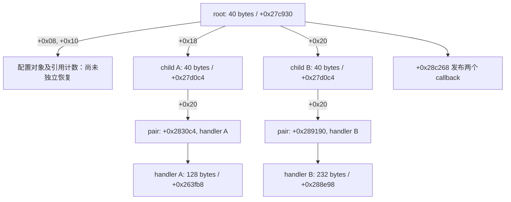

# 默认配置下的 signer 构造和 callback 发布

当前已恢复两个 child、两类 handler、引用计数 wrapper、root 已观测字段装配、空 callback 容器、最终 callback pair 绑定，以及 264-byte root 配置进入初始化器前的 Python 布局。**完整 root constructor 与独立 fresh-input Medusa 仍未完成。** 本页只适用于已测番茄 `7.1.3.32` native artifact，不外推到抖音或其他平台。

两类证据分别是 [同次构造采样](evidence/vm9_signer_constructor_graph_20261003.json) 和 [新建内存对照](evidence/vm9_signer_objects_python_20261003.json)。前者说明实际桥接器走了哪条路径；后者说明哪些对象字段可以由输入生成。

## 实际默认路径与旧结论纠正

APK 默认 A/B 为 `2`。在这个配置下，singleton getter `+0x1658e4` 分配 16 字节 wrapper 和 40 字节 root，调用 `+0x27c930` 构造 root，再通过 `+0x165968` 为 wrapper 生成初值为 1 的四字节引用计数。singleton slot/guard 分别是 `+0x3d15d8/+0x3d15e0`。

root constructor 内的发布 helper 是 **`+0x28c268`**，调用点为 `+0x27cd9c`。以前报告中的 `+0x2a8760` 是旧误配 A/B 控制中的另一条真实路径，不是默认配置路径。证据和旧 exporter 已同步纠正。

新只读探针从 constructor 入口的真实 X0 获取对象地址，跟踪对象写入和 publication/return 时的快照。没有向 guest 注入对象、修改虚表或更换 handle。两轮探针均生成 802 字节 Medusa，与未加对象探针的同输入控制组摘要相同；初始化基本块为 97,657 条，丢弃 0 条。本轮采样未发送新的线上请求。

WriteHook 的 reported PC 可能指向执行块的邻近位置。字段写入归属必须结合静态指令和调用路径确认，不能把 reported PC 直接当作精确 store 地址。

## 对象关系



root 的 `+0x00` 在当前对象写入记录中没有被 constructor 写入。快照中恰好为零，不能据此把清零这个字段当成构造规则。`construct_signer_root` 现在只装配调用者显式提供的 `+0x08/+0x10/+0x18/+0x20` 四个依赖；服务 singleton 的已测构造分支已恢复，但 root 前段配置对象和全局副作用仍需独立恢复。

| 组件 | 可生成的布局与边界 |
| --- | --- |
| 16 字节 reference wrapper | 对象指针、四字节 count 指针；count 初值 1。引用对象为 NULL 时也分配 count |
| reference copy | 复制两个指针；count 非空则做 32 位加一，保留 native 溢出及自别名行为 |
| 40 字节 child | 虚表、152 字节 state 指针、callback 容器引用/count、16 字节 pair 指针 |
| callback 容器 | 从三个 descriptor 输入字生成对象，另分配 40 字节 controller 和 40 字节 sentinel；sentinel 的未写 padding 保留 |
| 232 字节 handler | 生成两组 NULL reference/count 和 mutex holder；清 `+0x30..+0x4f`；在 `+0x50` 构造 state，末尾三字节 padding 保留 |
| 128 字节 handler | 同样生成基类字段；在 `+0x50/+0x60` 复制服务/flag references。可由显式依赖装配，也可按 native 顺序调用两个已恢复的 getter，生成服务的 0x2d0 字节配置图和 flag 的 2 字节 payload |
| callback pair | child constructor 只分配，不写内容；root 随后写入入口地址与 handler 指针 |
| 40 字节 root | 保留 `+0x00`，写入两个 configuration/reference 指针和两个 child 指针；不创建 singleton 或 lazy string |

pair 的入口由真实虚表方法返回：128 字节 handler 的虚表 `+0x35dc50`、slot `+0x68` 经 `+0x28509c` 返回 `+0x2830c4`；232 字节 handler 的虚表 `+0x35f7e0`、slot `+0x60` 经 `+0x28aee0` 返回 `+0x289190`。同次快照确认这两种绑定，不需要假设两个 pair 可以互换。

## callback 语义

`+0x28c268` 按顺序调用 `0x2000001`、`0x2000002`。wrapper `+0x28c308` 传入同一个 root，int 参数为 0，string/object 为 NULL。两个调用都完成后才开始清理两个返回引用。

返回条件是 **首个 JNI 返回引用非 NULL**，没有 Boolean unboxing。清理 helper `+0x26f1d0` 在 env/ref 非空时调用 `GetObjectRefType`（虚表 `+0x740`），再按类型调用 DeleteLocalRef（`+0xb8`）、DeleteGlobalRef（`+0xb0`）或 DeleteWeakGlobalRef（`+0x718`）。未知类型不删除；env/ref 为空时不查询类型。

这恢复了 publisher 的调用规则。它没有生成 Java 对象存储、线程 attachment 或完整 callback 表；实际宿主需要提供这些依赖。

## Python 调用与复核

[python/vm9_objects.py](python/vm9_objects.py) 提供 `construct_reference_wrapper`、`copy_reference_wrapper`、`construct_mutex_state`、`construct_callback_container`、`construct_signer_child`、`construct_signer_handler` 和 `bind_signer_child_callback`。接口使用以 `address >> 12` 为索引的 4,096 字节可写 pages。

`allocate(staged_pages, size)` 必须只改传入 pages，并返回实际可读写的 guest 地址。引用计数和 callback 对象由输入与分配过程生成，不能传捕获对象充当独立状态。分配失败、未映射输出及错误 handler 类型会拒绝并回滚 pages；外部 allocator 的账本或其他宿主副作用不在回滚保证内。

先构造 child，再构造对应 handler，最后绑定 callback pair：

```python
child = construct_signer_child(
    pages, object_address=child_address, image_base=image_base, allocate=allocate)
construct_signer_handler(
    pages, object_address=handler_address, image_base=image_base,
    allocate=allocate, kind="embedded_state")
bind_signer_child_callback(
    pages, child_address=child.object_address, handler_address=handler_address,
    image_base=image_base, kind="embedded_state")
```

另一类 handler 的 `kind="service_refs"` 可以传入真实初始化的 `service_reference_address` 与 `flag_reference_address`，或设置 `initialize_services=True`，由 Python 在对应 reference copy 前依次调用真实布局的服务/flag getter。首次调用需显式提供 `thread_id`，已发布的 getter 不需要它。`construct_service_reference(kind="service")` 默认调用已恢复的 `construct_service_payload`，不再要求外部 initializer。

`construct_lazy_reference` 支持无竞争的单线程 guard：byte0 非零时返回 slot；byte0 为零时，byte1 的 bit1 表示正在初始化，模型拒绝递归/等待；byte1 等于 1 时 acquire 返回 0，仍返回 slot。冷启动把显式线程 ID 写入 guard+4，把 byte1 写为 2；发布 wrapper 后 release 将 byte0/byte1 都写为 1，保留 +2/+3 padding。异常时 page map 回滚，外部 allocator 账本不在回滚保证内。configuration、service、flag 的 image-relative guard/slot 分别为 `0x3d15d0/0x3d15c8`、`0x3d1568/0x3d1560` 和 `0x3debc0/0x3debb8`。

旧 [vm9_service_singletons_python_20261003.json](evidence/vm9_service_singletons_python_20261003.json) 的 5/2 是 Python 自检，不能当作完整 native 等价证明。2026-10-04 的真实 guard 指令对照纠正了旧模型只写 byte0、遗漏 byte1/线程 ID 的差异。新增 [vm9_service_singletons_native_20261004.json](evidence/vm9_service_singletons_native_20261004.json) 有 72 个 native 差分案例和 15 个拒绝/回滚案例。

## 已恢复的服务 payload

`+0x281700` 的 0x2d0-byte 对象由输入生成，不复制捕获对象。模型分别读取 readonly ELF 常量、relocated GOT 和调用者提供的 guest 字符串/数值。服务 getter 冷启动共进行 27 次分配；其中 payload constructor 本身为 24 次，另有外层 wrapper、payload 和 count 三次。

| payload 字段 | 构造规则 |
| --- | --- |
| `+0x00` | 新分配 152-byte state 指针；先整体清零，再构造虚表和 mutex state |
| `+0x08/+0x10` | 清 u64 和一个字节；其余 padding 保留 |
| `+0x18..+0x3f` | callback 容器，虚表 `+0x35b7c0`；descriptor 为 `+0x25686c/+0x165334/+0x281958`；40-byte controller 的 hook 为 `+0x24b560`，另有 40-byte sentinel |
| `+0x40/+0xa0/+0x68` | 分别清 16/16/48 字节 |
| `+0x50/+0xb0/+0x58` | u32 `0x10000`、u32 零、image+`0x6e500` 的 16-byte 常量 |
| `+0x98` | 新分配 48-byte mutex holder，NULL attributes 的 bionic mutex 布局 |
| `+0xb8` | 新分配的 24-byte empty string 对象及四字节引用计数 |
| `+0xc8/+0xd0` | 清 u64/u32 |
| 17 个 inline string 对象 | 逐次构造，虚表 `+0x34f5f8`。`+0x298` 使用 ELF 空字符串；其余从 GOT `+0x374fc0` 指向的 pointer slot 每次重新解引用 |
| `+0x108/+0x160/+0x180/+0x190/+0x1b0/+0x1c8` | 在 native 读点保存 GOT `+0x375020` 的有符号 u32，生成重复整数和 float32；后续分配改变输入不会改写已保存值 |
| `+0x1b8/+0x1c0/+0x290` | 在 native 读点保存 GOT `+0x375030` 指向的 u64 |
| `+0x2b0` | 在最后一个字符串构造前读取 image+`0x3e0b58` |

新 verifier 比较整个 guest 对象/分配区和所有加载的 image pages，包括 guard/slot 全局状态。覆盖两个 image base、跨页、ELF 默认值、NULL/空/UTF-8/长字符串、正负整数和 int32 边界、冷热 guard、服务到 handler 的连续构造，以及 allocator 在分配中修改字符串源和数值的输入时序。真实 ELF guard helpers 和匹配 libc 的 `pthread_mutex_init` 指令均参与执行。

```python
construct_signer_handler(
    pages, object_address=handler_address, image_base=image_base,
    allocate=allocate, kind="service_refs", initialize_services=True,
    thread_id=guest_thread_id,
)
```

模型只保证测得的成功、无竞争构造分支；operator-new 重试/抛异常和诊断全局副作用仍不在模型内。caller 必须提供合法 image/GOT 输入和可写分配区。

[python/vm9_callbacks.py](python/vm9_callbacks.py) 的 `publish_signer_handle` 接收 root、env、invoke、get_reference_type 和 delete_reference。它实现已测发布和清理顺序，返回首个引用是否非空；宿主异常直接传播。

用本地匹配的私有 ELF 复核组件：

```text
python python/verify_vm9_signer_objects.py --library /private/libmetasec_ml_71332.so --libc /private/libc.so --output /private/signer-objects.json
```

验证器加载 ELF 代码和 relative relocations，在两种 image base 下新建有非零填充的 guest 内存。92 个对照验证对象布局、分配顺序、root 依赖装配、跨页、保留 padding、count 溢出/自别名、pair 绑定和 JNI 调用清理顺序。pthread mutex 初始化执行真实 libc 指令。另有 13 个拒绝/回滚案例。

上述 92 个组件对照仍把服务 getter 作为显式 reference 输入边界。新的 72 个服务对照则真实执行三个 singleton getter 和 `+0x281700`；malloc、strlen、memcpy、memset、gettid 和成功的 guard mutex 是显式宿主边界，diagnostic scope effects 仍被排除。验证运行需要 Unicorn/pyelftools；模型本身不调用 JVM。

```text
python python/verify_vm9_service_singletons.py --library /private/libmetasec_ml_71332.so --libc /private/libc.so --output /private/service-singletons.json
```

## 264-byte root 配置：布局已恢复，初始化器仍需移植

`construct_root_configuration_layout` 对照 `+0x257084` 到 `+0x257240` 的真实指令，生成 264-byte 对象及 30 次嵌套分配。它在复制第三个配置字符串到临时引用、调用 `+0x257308` 之前结束，不能直接当作完成初始化的 root 使用。它与 8-byte configuration singleton 是不同对象。

| 字段 | Python 已恢复的规则 |
| --- | --- |
| `+0x00/+0x08` | 虚表 `+0x35b688`；复制初始 reference/count，非空 count 加一 |
| `+0x18/+0xc0` | 两个新建 40-byte callback 容器，各有 controller、sentinel 和 reference count；descriptor 为 `+0x182d6c/+0x182d6c/+0x188a94` |
| `+0x28/+0x38/+0x48/+0x58/+0x70/+0xb0` | 六个新建空 string 对象与 count；从 ELF `+0x6fe64` 读取字符串输入 |
| `+0x68` | u64 全一 |
| `+0x80/+0x90` | 按调用次序复制两个输入 reference/count，保留共享计数与 u32 溢出行为 |
| `+0xa0/+0xd8/+0xf0` | NULL reference，分别新建初值为 1 的四字节 count |
| `+0xd0/+0xe8` | 调用者的 u32 flag；u32 零；邻近 padding 保留 |
| `+0x100` | 新建 152-byte state，先清零再执行已恢复的 state/mutex 构造规则 |

同一 owner 还新增 `decode_masked_bytes`、`lock_uncontended_mutex` 和 `unlock_uncontended_mutex`。`+0x167e54` 逐字节读 mask、读 source、写 XOR 结果；遇到零 mask 停止，不补字符串终止符。模型保留输出与 source/mask 重叠时的读取次序。mutex 只实现已测 bionic normal 分支：`0/0x2000 → 1/0x2001 → 0/0x2000`，只改低半字，保留其余字节；竞争、递归、错误检查和销毁状态拒绝。该模型不提供真实线程原子性。

[配置组件证据](evidence/vm9_configuration_primitives_native_20261004.json) 共 72 个 native 差分、25 个拒绝/回滚案例。其中 16 个验证配置布局、完整分配顺序、共享引用、NULL count、溢出、flag 和跨页；其余 56 个验证 decoder 和 mutex。所有模型输入均由 fresh ELF 或显式 guest 输入生成。

```text
python python/verify_vm9_configuration_primitives.py --library /private/libmetasec_ml_71332.so --libc /private/libc.so --output /private/configuration-primitives.json
```

## fresh ELF 的 native 初始化基线

新的 [root 初始化证据](evidence/vm9_root_configuration_native_20261004.json) 在两个 image base、八种 SDK 属性输入下，真实执行 `+0x257578 → +0x257084 → +0x257308`，16 个案例均正常返回，各进行 206 次分配与 31 对 mutex lock/unlock。**这项证据是 native 验证基线，初始化器仍由 Unicorn 执行，不能当作纯 Python 配置初始化完成。**

前两个 root 输入共享同一 reference；两个不同的字符串从 ELF 常量解码，长度分别为 4 和 240。输入 count 使用显式测试值 7。字符串内容只留在本地内存中。malloc/free 的 ABS64 链接按 relocation 表绑定到明确分配边界，不能把 NULL allocator descriptor 随意替换成业务 callback。

系统属性 getter `+0x271ba8` 解码名称到 `+0x3df150`、在 `+0x3df168` 发布名称 flag，并读取 `+0x3df148` 的 u32 cache。cache 为零才 find/read；解析结果按有符号 w0 比较，至少为 1 才写 cache。实测 cache：属性不存在、`0`、`-1` 为 0；`30` 为 30；带空白、正号与后缀的输入为 31；`4294967326` 截成 w0 后为 30；`2147483648` 及正 int64 溢出输入返回 0。该解析器经过 136-byte singleton 与 native 包装；目前没有用简化 atoi 替代它。

这次还修复了验证环境本身的干扰：旧 pthread 区间与深调用栈重叠，真实 `pthread_getspecific` 曾把保存的返回地址覆盖为 1。只移动 TLS/pthread 区域的对照恢复了正确返回。新验证器检查栈不进入 TLS 区域；当前最深 SP 为 guest+`0xd180`，TLS/pthread 区域结束于 guest+`0xab00`。

真实 libc 执行 mutex、strtol、pthread once/key 和 condition broadcast 等指令。显式虚拟宿主只提供属性值、clock/errno、文件不存在、目录 EEXIST、socket family 不支持、无等待者 futex WAKE，以及两个析构登记；不执行未知析构、不进行宿主文件或网络操作。输入与输出状态不能外推为实际手机环境已验证。

```text
python python/verify_vm9_root_configuration.py --library /private/libmetasec_ml_71332.so --libc /private/libc.so --output /private/root-configuration.json
```

## 88-byte 对象构造及内部解析器（2026-10-04）

`construct_configuration_object_layout` 已恢复 `+0x26194c → +0x261a1c` 的构造前缀。在两个输入长度均为非负、分配成功时，共进行九次嵌套分配。它在后续初始化前停止；其返回的 `ConfigurationObjectLayout88` 不能当作已初始化对象使用。

| 字段/全局 | 恢复规则 |
| --- | --- |
| image `+0x3deb60/+0x3deb68` | u32 flag 为零时，从 source/mask `+0x9a68c/+0x9a6dc` 解码，再发布 flag=1；任意非零 flag 均保留原内容 |
| object `+0x00` | 虚表 `+0x35ba78` |
| `+0x08` | 新建 24-byte string，从第一个输入 string 克隆，另建初值为 1 的四字节 count |
| `+0x18` | NULL reference，另建初值为 1 的四字节 count |
| `+0x28` | 从第二个输入 string 克隆的 inline 24-byte string |
| `+0x40..+0x47` | 未写 padding 保留 |
| `+0x48` | 新建 48-byte container/reference/count，容器虚表 `+0x35b808`，callback/context/comparator 为 `+0x182d6c/0/+0x188a94` |
| container `+0x20/+0x28` | inline comparator 和新建 8-byte holder；holder 指向新建 24-byte sentinel，sentinel 前两个指针自引用、第三个指针为 NULL |

这里的 48-byte container 与之前的 40-byte callback 容器具有不同的内部布局，分别建模。`clone_string_object` 对照 `+0x2483e0`：先保存 source object 的 u32 length，再写目标，分配后才读 source payload pointer；按声明长度复制，保留内部 NUL，并补一个终止字节。负 int32 length 不分配，但保存原 length 与回绕后的 capacity；malloc NULL 保留长度和 NULL payload。`construct_sized_string_object` 对照 `+0x2481fc`，其负长度或 malloc NULL 会清空两个长度字段，与 clone 的失败语义不同。

`acquire_uncontended_shared_reader` / `release_uncontended_shared_reader` 对照 `+0x32a444/+0x32a4fc`：锁 normal mutex，改变 `mutex+0x88` reader count，再解锁。已验证共享 bit、跨页和 `0x7ffffffe` 边界。writer bit、饱和 count、release 零 count、等待和 signal 分支拒绝并回滚。它们只提供串行 guest 内存转换，不提供宿主线程原子性。

[对象组件证据](evidence/vm9_configuration_objects_native_20261004.json) 有 **140 个 native 差分和 23 个拒绝/回滚案例**，覆盖上述对象前缀、全局 flag、声明长度克隆、allocator 改变源输入的读点、self alias、reader count 与未映射页。clone 的 malloc NULL 另有 Python 自检，未将它计入 native 差分数。

后续 native 路线已实测为 `+0x261c54 → +0x261cb0 → VM +0x9a6f0`。其中 `+0x258e7c` 的 Base64 解码/reference 依赖已恢复为 `construct_decoded_configuration_reference`：先按输入长度分配临时缓冲区，执行 `decode_configuration_base64`，有效非空结果生成 sized string，随后调用显式 free，最后构造 reference/count。无效或空结果生成 NULL reference，而非伪造成功字符串。

`decode_configuration_base64` 对照 `+0x245814`，从私有 ELF `+0x95cc0` 读取 lookup table，保留 native 的换行、行尾空格、padding、缓冲区查询和未满组丢弃规则。返回 0、-42 或 -44；无效输入不写输出长度。查询/容量不足使用 native 的向上取整长度，实际成功长度按完整解码组计算。不要以标准 Base64 库的行为替代这些规则。[解码组件证据](evidence/vm9_configuration_decode_native_20261004.json) 有 **200 个 native 差分和 11 个拒绝/回滚案例**，包含空输入、二进制、内部 NUL、非标准残组、重叠输出、跨页和分配/free 拒绝。free 在此 verifier 中为明确的不复用分配边界；真实 allocator 的 free 状态仍需接入实际宿主。

```text
python python/verify_vm9_configuration_objects.py --library /private/libmetasec_ml_71332.so --libc /private/libc.so --output /private/configuration-objects.json
python python/verify_vm9_configuration_decode.py --library /private/libmetasec_ml_71332.so --output /private/configuration-decode.json
python python/verify_vm9_root_vm_prefix.py --library /private/libmetasec_ml_71332.so --libc /private/libc.so --output /private/root-vm-prefix.json
```

新的 [同次 fresh native VM 对照](evidence/vm9_root_vm_prefix_native_20261004.json) 使用两个 image base、SDK 缺失/30 两种输入，共四次 native 控制运行和八段 Python VM 对照：

| VM 子阶段 | 已验证边界 | 结果 |
| --- | --- | --- |
| root `+0x991c0` | 第 513 步 `+0x99b40` 的 `+0x26194c` callback 内，Python 生成至 `+0x261a1c` 的前缀；包括此前两次和本构造九次分配 | 整个 guest 对象/分配区、11 次分配顺序、全部主 image pages 与同次 native 一致 |
| parser `+0x9a6f0` | 第 220 步 `+0x9ab00`，wrapper `+0x2634d0` 调用 `+0x248684` 前 | guest 对象/分配区、六次分配顺序、全部主 image pages、32-byte descriptor 与同次 native 一致 |

两段 VM 的初始状态均来自**这次 native 运行的构造前导快照**，用于差分验证；没有外部签名捕获页，也没有 trace/branch/opaque 注入。但构造前导尚未全部由 Python 生成，所以这不是从完整 Python 启动到解析结束的证明。主 image 对照也不包含 libc、TLS 和 native 调用栈的全部副作用。当前首个未恢复 parser callback 为 `+0x248684 → +0x246ba0` 的字符串追加及容量处理。

## 证据用途与剩余工作

同次采样把 root → child → handler → pair → 两次发布连接起来，可用于排除错误 handle/对象类型和错误 publisher 分支。新建内存对照证明这些局部对象可以参数化生成，不能据此声称完整初始化已经独立完成。

两个服务 singleton、264-byte root 配置布局、88-byte 对象前缀和内部解析器的 Base64/reference 依赖已恢复。下一步从 `+0x248684` 字符串追加及容量处理继续，补齐内部解析器和 88-byte 对象初始化；然后继续 `+0x257308` 的 root VM 初始化、136-byte singleton、属性解析所依赖的启动状态、诊断与全局副作用及剩余 native callbacks，再接入 VM9 fresh-input 签名并贯穿同次采样验证。新的 native 基线可用于逐字段、逐分配和全局写入差分，避免把验证环境的 TLS 重叠或未解析 import 当作目标行为。当前搜索仍无非空响应与分页证据；无 JVM Rust 下载器、抖音/起点闭环及最终 Pages 搜索下载网页也尚未完成。
